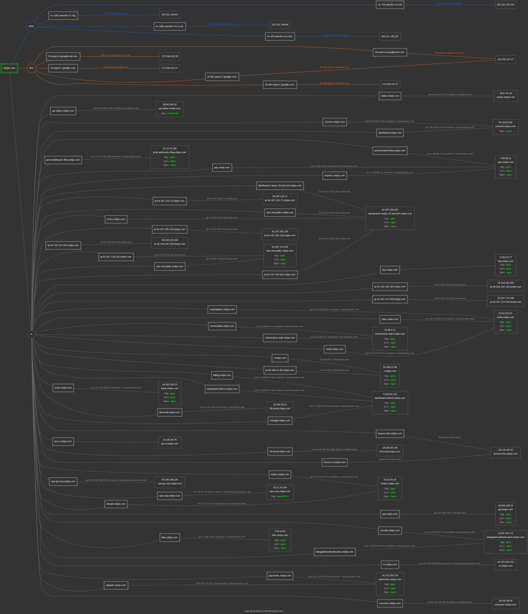
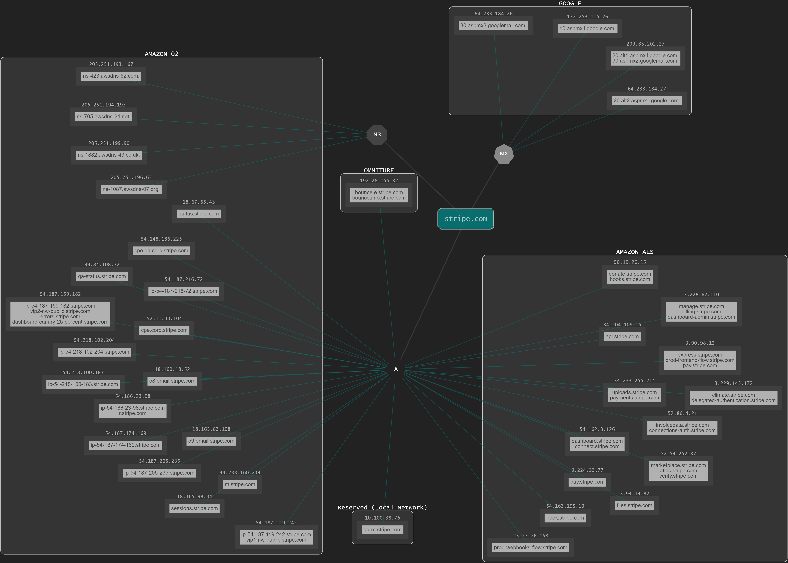

# Stripe

**Legal name:** Stripe, Inc. [Crunchbase](https://www.crunchbase.com/organization/stripe)

**Initial domain to look for:** stripe.com
This domain name is currently operated by Safenames Ltd.

**IP address:** 54.186.23.98 (I cannot access Stripe's site using his IP)

**Server type:** nginx

**Domain ID:** 891022_DOMAIN_COM-VRSN

**Other IP addresses:**  Probably Stripe is using the next two IP addresses for load balancing.

1. 54.187.119.242
2. 54.187.159.182

**CIDR for stripe.com:**
1. 54.192.0.0/12
2. 54.208.0.0/13
3. 54.160.0.0/11
4. 54.220.0.0/15
5. 54.144.0.0/12 
6. 54.216.0.0/14

## Name Servers

Stripe has the following name servers that I found using whois on Kali Linux.

1. ns-423.awsdns-52.com
**IP address:** 205.251.193.167

2. ns-1882.awsdns-43.co.uk
**IP address:** 205.251.199.90

3. ns-705.awsdns-24.net
**IP address:** 205.251.194.193

4. ns-1087.awsdns-07.org
**IP address:** 205.251.196.63

## Mail servers

Using the Kali Linux tool "host" I found the next mail servers for stripe.com:

1. aspmx2.googlemail.com(30)
2. aspmx3.googlemail.com(30)
3. aspmx.l.google.com(10)
4. alt1.aspmx.l.google.com(20)
5. alt2.aspmx.l.google.com(20)

### Hurricane Electric

Using Hurricane Electric you'll notice that most of Stripe's servers are Amazon servers, meaning that they do not use their own servers to host their site.

## Companies Stripe has invested in

According to [Crunchbase], Stripe has invested in 59 different companies. Nevertheless, to be able to get that information you must pay a suscription (Same thing for other sites), reason why I decided to look up for four different sites to try and get some of these investments.

1. Monzo
2. SendOwl
3. Accord
3. Upollo
4. Balance
5. Step Mobile
6. Pulley
7. Wave Mobile Money
8. Emarketing solutions
9. Dream Business System
10. Codat
11. Hydrotek Engineers
12. Kodama Systems
13. Nitricity
14. Wave Systems
15. Assembled
16. Mission Zero
17. Manara
18. Ramp
19. Forma
20. Archive
21. Omnipack
22. PayMongo
23. Check
24. Clear
25. Complete
26. WEBZELLA LTD
27. Worq Hat
28. PolyBit Inc
29. Paystack
30. BloomTech
31. Rapyd
32. Pilot
33. Pico
34. Fast
35. Safepay
36. TrueLayer

These 36 companies were found using [Crunchbase], [The Org], [dealroom.co] and [Tracxn]. With just these four I was able to get 36 out of 59 investments Stripe has made according to Crunchbase which is the must accurate site to look up for this info.

## Companies owned by Stripe

Using [Tracxn] I was able to get the 12 companies that Stripe owns, which are:

1. BBPOS
2. OpenChannel
3. Recko
4. Bouncer
5. TaxJar
6. Paystack
7. Touchtech Payments
8. Index
9. Payable
10. Indie Hackers
11. RunKit
12. Totems

## Whois historical records

According to whois historical records, stripe.com has always been under the control of Stripe, being almost the same since 2012 so there doesn't seem to be something really interesting here.

## Stripe's domains

Using the Whoxy API I was able to found 196 domains that Stripe owns. Since these were a lot of domains I wrote a really short code in Python that helped me to know which of these were actually accessible. This complete list is the following, note that "Not accessible" could mean a 404, 502, and all that kind of errors because I'm focusing only in those with a 200 code.

1. stripeypay.com - 200
2. stripeinvoice.com - 200
3. stripeforsalesforce.com - Not accessible
4. stripe-invoice.com - 200
5. stripepay.com - 200
6. stripecryptocurrencies.com - 200
7. stripe-inc.com - 200
8. stripe.mobi - 200
9. stripe.services - 200
10. devpayment.com - Not accessible
11. 4690.expert - Not accessible
12. stripesucks.com - Not accessible
13. stripe-wallet.com - Not accessible
14. contactstripe.com - Not accessible
15. goindex-dev.com - 200
16. securedstripesupport.com - Not accessible
17. gateway.expert - Not accessible
18. stripe.ventures - Not accessible
19. stripe-auth.com - Not accessible
20. stripeapi.com - 200
21. link.com - 200
22. stripe-vendors.com - Not accessible
23. ztripe.com - Not accessible
24. stripevendor.com - Not accessible
25. supportatstripe.com - 200
26. stripeextensions.com - Not accessible
27. trystripe.com - 200
28. stripe-infra.com - 200
29. stripesecureloggin.com - Not accessible
30. stripeauthentications.com - Not accessible
31. buyverifiedstripe.com - 200
32. stripeverifi.com - 200
33. reckostaging.com - Not accessible
34. stripebiling.com - Not accessible
35. stripe-billings.com - Not accessible
36. stripe-teck.com - Not accessible
37. stripe-sessions.com - Not accessible
38. stripehelpline.com - Not accessible
39. stripe-capital.com - Not accessible
40. strpe.net - 200
41. stripe.tips - 200
42. stripe1dashboard.net - 200
43. supportforstripe.com - Not accessible
44. goindex.com - Not accessible
45. xn--strpe-p4a.com - 200
46. stripe.casa - 200
47. stripedashboard.app - Not accessible
48. sorbetlanguage.com - 200
49. stripestatus.com - Not accessible
50. stripe.enterprises - 200
51. stripe.tax - Not accessible
52. stripe.training - 200
53. stripebillings.com - Not accessible
54. stripeverify.com - Not accessible
55. recko.io - 200
56. stripenoreply.com - 200
57. stripepayouts.com - 200
58. stripe-veri-acct-info-desk.com - 200
59. stripe-invoicing.com - Not accessible
60. stripe-support-uat.com - 200
61. stripesubscription.com - Not accessible
62. quickchip.blog - Not accessible
63. stripee.com - 200
64. stripe-dev.com - 200
65. validstripe.com - Not accessible
66. tiempolabs.com - Not accessible
67. frontiercarbonremoval.com - 200
68. quickchip.expert - Not accessible
69. stripecomingback.com - 200
70. devpayments.com - Not accessible
71. stripe-interview.com - Not accessible
72. stripecustomercare.com - 200
73. stripe.directory - Not accessible
74. stripeandroidpay.com - 200
75. stripeconnectors.com - Not accessible
76. stripesandbox.com - Not accessible
77. stripe.om - 200
78. stripe-press.com - 200
79. stripe-login.website - Not accessible
80. stripeshed.com - Not accessible
81. usukstripe.com - Not accessible
82. stripe-checkout.com - 200
83. dashboardupatestripe.com - Not accessible
84. reckoproduction.com - Not accessible
85. product.new - 200
86. stripeconnect.com - Not accessible
87. powdur.pro - Not accessible
88. stripeincs.com - 200
89. stripepay.net - 200
90. stirpe.info - Not accessible
91. stripeappmarketplace.com - 200
92. stripetechnologies.com - 200
93. stripeconfirm.com - Not accessible
94. carbonremovalamc.com - 200
95. stripeseurity.com - Not accessible
96. ipostripe.com - 200
97. noncegenver.com - 200
98. stripe-terminal-local-reader.net - Not accessible
99. devstripe.com - Not accessible
100. stripe-confirm.com - Not accessible
101. stripe-donate.com - 200
102. stripepreview.net - 200
103. genvercenon.com - 200
104. cenongenver.com - 200
105. stripedevs.com - 200
106. markdoc.dev - 200
107. stripe.email - 200
108. stripeelement.com - Not accessible
109. stripeinfo.com - Not accessible
110. workswithstripe.com - 200
111. invoice.new - 200
112. tiempoapp.com - Not accessible
113. stripequickpay.com - Not accessible
114. stripesupportt.com - Not accessible
115. slashdevslashmerch.com - 200
116. supportedstripe.com - 200
117. directorystripe.com - Not accessible
118. stripe2intuit.com - Not accessible
119. stripe.insure - Not accessible
120. stripefintech.com - Not accessible
121. stripeethereum.com - 200
122. stripenotifications.com - Not accessible
123. stripe-admin.com - Not accessible
124. stripepays.com - 200
125. stripe-dashboard.app - Not accessible
126. stripepayment.app - Not accessible
127. payable.com - 200
128. vernongence.com - 200
129. stripeecosystem.com - 200
130. stripemarketplace.com - 200
131. stripe.dev - 200
132. stripeidentity.com - 200
133. stripe-us.com - Not accessible
134. vernoncegen.com - 200
135. stripelogin.com - 200
136. supportstripe.support - Not accessible
137. stripeapp.net - 200
138. stripeatlas.net - Not accessible
139. stripe-online-payments.com - Not accessible
140. secureyourlifeonline.org - 200
141. encryption.expert - Not accessible
142. atlas-community.com - Not accessible
143. stripecrypto.com - Not accessible
144. sorbet-language.com - 200
145. frontierclimate.com - 200
146. stripevendors.com - Not accessible
147. stripeus.com - Not accessible
148. stripegptn.com - 200
149. stripe.exposed - 200
150. striep.com - 200
151. gptn.net - Not accessible
152. stripepayments.ca - 200
153. secureyourlifeonline.com - 200
154. stripebenefits.com - Not accessible
155. standardocs.org - Not accessible
156. link.engineering - Not accessible
157. buyastripeaccount.com - Not accessible
158. nonvergence.com - Not accessible
159. stripe.investments - Not accessible
160. stripeinvoicing.com - Not accessible
161. stripepayment.net - Not accessible
162. stripeyoungscientist.com - 200
163. account-stripe.net - Not accessible
164. striperadar.com - 200
165. stripe.loans - Not accessible
166. thegptn.com - 200
167. stripecharge.com - 200
168. stripe.loan - Not accessible
169. dashbord-stripe.com - Not accessible
170. stripe.expert - 200
171. frontiercdr.com - 200
172. stripe-ctf.com - Not accessible
173. stripe-payments.com - Not accessible
174. stripebill.com - Not accessible
175. stripe-billing.com - Not accessible
176. stripe-bill.com - Not accessible
177. standardnda.org - Not accessible
178. markdoc.tech - 200
179. stripepayments.app - Not accessible
180. stripe.express - 200
181. stripeblockchain.com - 200
182. standarddocs.org - Not accessible
183. stripe-connect.com - 200
184. stripe.today - 200
185. stripe-biling.com - Not accessible
186. stripe.financial - Not accessible
187. stripeaccount.com - Not accessible
188. stripe-sandbox.com - 200
189. stripenyc.com - 200
190. stripe.cool - Not accessible
191. stripe.site - 200
192. gptn.network - Not accessible
193. stripe.best - 200
194. stripe-payoutsco.com - Not accessible
195. stripepartnerecosystem.com - 200
196. opendocs.org - Not accessible

Once that I got all the domains that were actually accessible I navigated through them and found out that most of them will just return a ComLaude static page. In short terms, you won't get to see anything of interest in most of these domains.
Others of these domains are the domains for some of the companies that Stripe currently owns and some will actually redirect you to the main page at stripe.com. The reason why this is like this it's because Stripe buys some domains to avoid phishing.

## Stripe's subdomains

Using Subfinder I got a total of 391 subdomains for stripe.com. Most of them won't return you anything since they're used for some services. Others won't return anything because they're just for internal used and some will redirect you to a certain page from Stripe.
Since those were a lot of subdomains I tried to use DNSdumper instead, which gave me a mapping of the domain stripe.com with some interesting information that I already wrote down here but in a prettier way.

The complete list of subdomains I found is the following:

1. frontend-global-fsin1.stripe.com
2. prod-js-tree.stripe.com
3. sourcemaps.stripe.com
4. donate.stripe.com
5. info.stripe.com
6. ip-54-218-100-183.stripe.com
7. api-52-1-23-197.stripe.com
8. preprod-js.stripe.com
9. api-54-65-115-204.stripe.com
10. files-global-fsin2.stripe.com
11. fw4.stripe.com
12. api-13-56-173-232.stripe.com
13. api-34-238-187-115.stripe.com
14. api-52-63-119-77.stripe.com
15. buy.stripe.com
16. hooks.stripe.com
17. git.corp.stripe.com
18. qa.corp.stripe.com
19. lists.stripe.com
20. hub-adapter.stripe.com
21. www.sessions.stripe.com
22. hub-example-emailpay.stripe.com
23. verificator-main.stripe.com
24. api-52-196-95-231.stripe.com
25. api-34-239-14-72.stripe.com
26. api-13-56-126-253.stripe.com
27. connections-auth.stripe.com
28. api-54-187-182-230.stripe.com
29. ip-54-241-31-99.stripe.com
30. prod-partner-hdfc.stripe.com
31. bom.corp.stripe.com
32. issuing-hooks-nw4-public.stripe.com
33. ops-docs.corp.stripe.com
34. qa-files-cdn.stripe.com
35. jira.corp.stripe.com
36. preprod-crypto-js.stripe.com
37. preprod-connect-js.stripe.com
38. api-107-23-55-214.stripe.com
39. api-34-204-109-15.stripe.com
40. dashboard-canary-continuous.stripe.com
41. frontend-global-fiad2.stripe.com
42. admin.corp.stripe.com
43. prod-connections-bofa.stripe.com
44. newapi.stripe.com
45. community.stripe.com
46. docs.stripe.com
47. api-52-26-11-205.stripe.com
48. armada.stripe.com
49. qa-partner-hdfc.stripe.com
50. qa-partner-amex-east-asia-sponsored-merchant.stripe.com
51. qa-m.stripe.com
52. api-52-8-19-58.stripe.com
53. api-18-195-120-229.stripe.com
54. eqix-ema-sv.stripe.com
55. api-13-230-11-13.stripe.com
56. api-50-18-212-245.stripe.com
57. api-50-18-212-157.stripe.com
58. edge-billing.stripe.com
59. dashboard.stripe.com
60. pdx.corp.stripe.com
61. e.stripe.com
62. public.stripe.com
63. fe-nlb.stripe.com
64. preprod-pdx.corp.stripe.com
65. merchant-ui-api.stripe.com
66. pw4.stripe.com
67. corp.stripe.com
68. api-13-230-90-110.stripe.com
69. api-52-62-14-35.stripe.com
70. files-global-fnrt2.stripe.com
71. atlas.stripe.com
72. api-34-240-123-193.stripe.com
73. files-global-bluegreen-iad.stripe.com
74. dashboard-canary-25-percent.stripe.com
75. 4rt6k2fsnxqmlsva3ydt375fewvmkxoj.dkim.custom-email-domain.stripe.com
76. m.stripe.com
77. api-52-76-156-251.stripe.com
78. api-107-21-62-106.stripe.com
79. api-54-67-48-128.stripe.com
80. edge-dashboard.stripe.com
81. qa-crypto-js.stripe.com
82. connect-js.stripe.com
83. partner-ideal-qa.stripe.com
84. global.stripe.com
85. ip-54-241-31-102.stripe.com
86. api-13-57-90-254.stripe.com
87. barclays-hooks.stripe.com
88. sftp.stripe.com
89. checkout-api.stripe.com
90. stripe-credit.stripe.com
91. ip-54-186-23-98.stripe.com
92. code.stripe.com
93. press.stripe.com
94. r.stripe.com
95. api-54-149-153-72.stripe.com
96. files-cdn.stripe.com
97. manage.stripe.com
98. api-54-67-52-245.stripe.com
99. email-57.stripe.com
100. jss-nw-public.stripe.com
101. preprod-checkout.stripe.com
102. edge-invoice.stripe.com
103. errors.stripe.com
104. status.stripe.com
105. api-13-57-157-116.stripe.com
106. api-107-21-62-9.stripe.com
107. partner-ideal-prod.stripe.com
108. invoicedata.stripe.com
109. edge-js.stripe.com
110. ip-50-18-189-108.stripe.com
111. edge-pay.stripe.com
112. book.stripe.com
113. qa-cgk.corp.stripe.com
114. local.corp.stripe.com
115. api-52-26-14-11.stripe.com
116. ip-50-18-189-113.stripe.com
117. hellosign-hooks.stripe.com
118. dge-js.stripe.com
119. edge-js-tree.stripe.com
120. issuing-hooks-public.stripe.com
121. invoice.stripe.com
122. api-52-74-114-251.stripe.com
123. api-52-53-133-6.stripe.com
124. eqix-ema-dc.stripe.com
125. qa-invoice.stripe.com
126. api-34-200-27-109.stripe.com
127. express.stripe.com
128. ip-54-241-34-107.stripe.com
129. api-34-200-47-89.stripe.com
130. cdnhal1-nw-public.stripe.com
131. api-54-183-95-195.stripe.com
132. prod-partner-amex-east-asia-sponsored-merchant.stripe.com
133. 59.email.stripe.com
134. irc.stripe.com
135. shop.stripe.com
136. api-52-77-80-43.stripe.com
137. products.stripe.com
138. api-w2.stripe.com
139. api-13-228-224-121.stripe.com
140. api-34-241-54-72.stripe.com
141. api-52-63-106-9.stripe.com
142. groups.stripe.com
143. api-107-23-48-182.stripe.com
144. api-50-18-212-223.stripe.com
145. api-35-156-131-6.stripe.com
146. bounce.e.stripe.com
147. uploads.stripe.com
148. qa-pdx.corp.stripe.com
149. calendar.stripe.com
150. spf1.stripe.com
151. confluence.corp.stripe.com
152. edge-button.stripe.com
153. api-eu2.stripe.com
154. api-west.stripe.com
155. dashboard-canary-1-percent.stripe.com
156. gateway-nw1.stripe.com
157. api-13-57-155-157.stripe.com
158. api-35-163-82-19.stripe.com
159. cpe.corp.stripe.com
160. dashboard-canary-50-percent.stripe.com
161. support.stripe.com
162. qa-northwest.corp.stripe.com
163. media.stripe.com
164. api-54-246-172-72.stripe.com
165. www.api.stripe.com
166. api-13-57-98-27.stripe.com
167. cdg.corp.stripe.com
168. revoked.stripe.com
169. cmh.corp.stripe.com
170. finance.stripe.com
171. ip-54-218-102-204.stripe.com
172. codeint.stripe.com
173. panoplied-respect.stripe.com
174. api-52-62-203-73.stripe.com
175. api-52-22-83-139.stripe.com
176. apife3-nw-public.stripe.com
177. sf.stripe.com
178. careers.stripe.com
179. api-52-196-53-105.stripe.com
180. ip-50-18-189-115.stripe.com
181. ip-54-187-174-169.stripe.com
182. jira.stripe.com
183. api-52-73-161-98.stripe.com
184. lokalise-hooks.stripe.com
185. sentry.corp.stripe.com
186. frontend-global-tree.stripe.com
187. identity-hooks.stripe.com
188. hubble.corp.stripe.com
189. mobile-auth.stripe.com
190. ip-54-187-216-72.stripe.com
191. api-54-238-140-239.stripe.com
192. vip1-public.stripe.com
193. vip1-nw-public.stripe.com
194. prod-connections-chase.stripe.com
195. api-34-250-29-31.stripe.com
196. api-34-241-59-225.stripe.com
197. api-52-8-8-189.stripe.com
198. qa-api-w2.stripe.com
199. api-52-76-14-176.stripe.com
200. cdnhal5-nw-public.stripe.com
201. custom-email-domain.stripe.com
202. email.stripe.com
203. pay.stripe.com
204. api-52-59-173-230.stripe.com
205. api-52-36-167-221.stripe.com
206. api-34-223-201-215.stripe.com
207. pw3.stripe.com
208. q.stripe.com
209. stripe.com
210. east.corp.stripe.com
211. api-13-57-108-134.stripe.com
212. api-54-68-165-206.stripe.com
213. api-13-115-13-148.stripe.com
214. api-13-228-126-182.stripe.com
215. api-50-18-195-96.stripe.com
216. api-54-187-199-38.stripe.com
217. api-35-156-194-238.stripe.com
218. api-tls12.stripe.com
219. qa-bom.corp.stripe.com
220. api-e2.stripe.com
221. sales.stripe.com
222. fastly.stripe.com
223. pi.stripe.com
224. preprod-cmh.corp.stripe.com
225. prod-frontend-flow.stripe.com
226. ipaddr-3ds.stripe.com
227. northwest.corp.stripe.com
228. stripe-credit-ui.stripe.com
229. api-54-187-208-163.stripe.com
230. vip4-nw-public.stripe.com
231. api-nw2.stripe.com
232. verificator.stripe.com
233. api-50-16-2-231.stripe.com
234. filedrop.stripe.com
235. drop.stripe.com
236. email-91.stripe.com
237. delegated-authentication.stripe.com
238. qa-r.stripe.com
239. qa-cmh.corp.stripe.com
240. gateway.stripe.com
241. api-35-164-105-206.stripe.com
242. api-13-55-153-188.stripe.com
243. api-nw3.stripe.com
244. sourcemaps.corp.stripe.com
245. prod-webhooks-flow.stripe.com
246. greenhouse-outbound-mail.stripe.com
247. eidas-cert.stripe.com
248. email-74.stripe.com
249. api-13-112-224-240.stripe.com
250. api-54-68-183-151.stripe.com
251. vip4-public.stripe.com
252. edge-dashboard-admin.stripe.com
253. api-54-65-97-98.stripe.com
254. api-34-241-202-139.stripe.com
255. vip3-public.stripe.com
256. comm.stripe.com
257. api-e1.stripe.com
258. sessions.stripe.com
259. hoth.stripe.com
260. api-35-164-124-216.stripe.com
261. frontend-global-bluegreen-dub.stripe.com
262. cgk.corp.stripe.com
263. api-18-195-125-165.stripe.com
264. api-v.stripe.com
265. button.stripe.com
266. billing.stripe.com
267. payments.stripe.com
268. api-107-23-48-232.stripe.com
269. api-50-18-219-232.stripe.com
270. www.stripe.com
271. preprod-status.stripe.com
272. static.stripe.com
273. verify.stripe.com
274. edge-checkout-tree.stripe.com
275. frontend-global-bluegreen-syd.stripe.com
276. api-35-157-227-67.stripe.com
277. mail-p2.stripe.com
278. qa-connections-chase.stripe.com
279. qa-connect-js.stripe.com
280. dub.corp.stripe.com
281. edge-manage.stripe.com
282. not-a-git.corp.stripe.com
283. qa-east.corp.stripe.com
284. vip2-nw-public.stripe.com
285. api-83wzadmhqo.stripe.com
286. fastly-autofailover.stripe.com
287. info-link.stripe.com
288. qa-cdg.corp.stripe.com
289. answers.stripe.com
290. sandbox-acs.stripe.com
291. api-13-210-176-167.stripe.com
292. blik-hooks.stripe.com
293. js.stripe.com
294. bounce.stripe.com
295. ip-54-187-119-242.stripe.com
296. gems.stripe.com
297. api-34-214-229-69.stripe.com
298. climate.stripe.com
299. mail-p1.stripe.com
300. pw2.stripe.com
301. api-w1.stripe.com
302. checkout-api-modelt.stripe.com
303. files.stripe.com
304. api-52-211-198-11.stripe.com
305. api-35-158-254-198.stripe.com
306. api-canary-25-percent-nw4-2507531e-c5d5-49ea-b240-47bdb801140a.stripe.com
307. pw1.stripe.com
308. api.stripe.com
309. api-13-56-173-200.stripe.com
310. api-52-205-132-193.stripe.com
311. api-34-213-149-138.stripe.com
312. terminal-events.stripe.com
313. preprod-button.stripe.com
314. connect.stripe.com
315. checkout.stripe.com
316. qa-status.stripe.com
317. api-52-26-132-102.stripe.com
318. mail.stripe.com
319. api-52-212-99-37.stripe.com
320. enhance-public.stripe.com
321. qa-connections-bofa.stripe.com
322. terminal.stripe.com
323. api-52-54-150-82.stripe.com
324. api-13-55-5-15.stripe.com
325. dashboard-canary-5-percent.stripe.com
326. cdn.qa-files.stripe.com
327. bounce.info.stripe.com
328. api-w4-6d0ce81b-50fb-4733-a339-d7c901f61bc6.stripe.com
329. drop2-nw-public.stripe.com
330. edge-api-eu2.stripe.com
331. 58.email.stripe.com
332. indonesia-bt.stripe.com
333. something.status.stripe.com
334. crypto-js.stripe.com
335. api-52-76-174-156.stripe.com
336. api-52-65-161-237.stripe.com
337. qa-api.stripe.com
338. qa-dub.corp.stripe.com
339. api-52-220-44-249.stripe.com
340. preprod-invoice.stripe.com
341. hooks-canary-continuous.stripe.com
342. hub-detokenization.stripe.com
343. api-18-194-147-12.stripe.com
344. api-52-74-98-83.stripe.com
345. api-52-57-221-37.stripe.com
346. api-13-210-129-177.stripe.com
347. vip2-public.stripe.com
348. fw2.stripe.com
349. stripe-cli.stripe.com
350. marketplace.stripe.com
351. edge-checkout.stripe.com
352. auth.stripe.com
353. ip-54-187-159-182.stripe.com
354. ip-54-187-205-235.stripe.com
355. cpe.qa.corp.stripe.com
356. qa-ipaddr-3ds.stripe.com
357. files-global-tree.stripe.com
358. issuing-key.stripe.com
359. npm-registry.local.corp.stripe.com
360. qa-button.stripe.com
361. api-54-152-36-104.stripe.com
362. api-52-213-35-125.stripe.com
363. api-canary-75-percent-nw4-e45d6f35-51b2-4787-8a7b-5da39afe20a5.stripe.com
364. files-global-bluegreen-syd.stripe.com
365. api-nw1.stripe.com
366. dashboard-admin.stripe.com
367. t.stripe.com
368. api-34-250-89-120.stripe.com
369. files-global-fdub2.stripe.com
370. vhdzr43y2rwfzp2ehhvtdo4xwcfcgadu.dkim.custom-email-domain.stripe.com
371. portal.stripe.com
372. qa-api-global-bluegreen.stripe.com
373. qa-js.stripe.com
374. blog.stripe.com
375. edge.stripe.com
376. api-13-57-156-206.stripe.com
377. ip-50-18-189-119.stripe.com
378. vip5-public.stripe.com
379. api-34-237-253-141.stripe.com
380. api-34-202-153-183.stripe.com
381. api-34-237-201-68.stripe.com
382. api-54-246-172-168.stripe.com
383. api-50-18-195-3.stripe.com
384. authenticate.stripe.com
385. gator.stripe.com
386. preprod.corp.stripe.com
387. qa-checkout.stripe.com
388. api-52-25-214-31.stripe.com
389. api-50-18-213-51.stripe.com
390. api-52-204-6-233.stripe.com
391. site-admin.stripe.com

### Local network

Something interesting that I found while using DNSdumper was that Stripe does actually have one IP that belongs to them. Unfortunately, this is an IP for a local network so when I decided to try and see what's in there, I wasn't able to get anything.